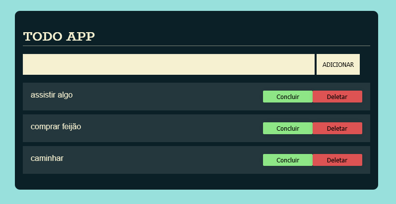

# TODO APP

### Projeto simples de um todo feito no curso de html dom e javascript da alura do programa one.

### 🚀 Tecnologias

 - HTML e CSS
 - Javascript 
 - Vs Code

 ### 📝 Autor

 - [Levy](https://www.linkedin.com/in/levy-matias/)