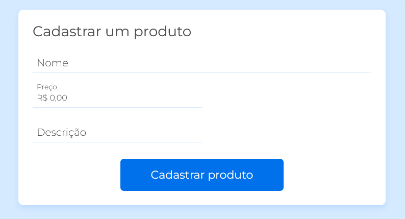

# Projeto Doguito Petshop 🐕

Projeto desenvolvido no curso de validação de formulários da plataforma alura do programa One.

Desenvolvemos um formulário para cadastro onde usamos validações para campos de nome, email, senha, cpf, cep, etc. E criamos regex para cpf e cep, também  ultilizamos api viaCEP para preencher os outros campos automáticamente.

**Aprendemos:**

   - Fazer validações no próprio HTML utilizando os atributos required e type
   - Usar regras de regex dentro do atributo pattern para validar o campo de senha.
   - Mandar uma mensagem customizada de erro no balão do navegador.
   - Criar funções para validações customizadas do formulário
   - Definir mensagens customizadas para validações fora do HTML
   - Utilizar data attributes para trabalhar com JavaScript
   - Deixar a função de validação mais genérica para funcionar com qualquer input
   - A instalar e usar o plugin Liveserver
   - Como baixar e rodar o browser-sync
   - Como mostrar a mensagem de erro diretamente no HTML
   - Como customizar as mensagens de erro de validação
   - A validar cpf com números repetidos
   - A matemática por trás da validação de um CPF
   - Recursão de função
   - Outra estrutura de regex para a pré validação do CEP
   - Como fazer uma requisição para a API da ViaCEP
   - Preencher outros campos do formulário com a resposta da API da ViaCEP
   - Como adicionar máscara monetária para o campo de preço.

 ## 🚀 Tecnologias

 - HTML e CSS
 - Javascript e Json
 - Fetch API
 - [SimpleMaskMoney](https://github.com/codermarcos/simple-mask-money)

 ## 📝 Autor

 - [Levy](https://www.linkedin.com/in/levy-matias/)

---